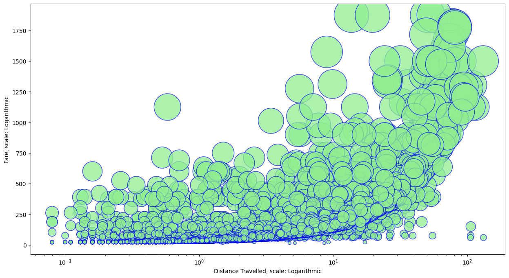
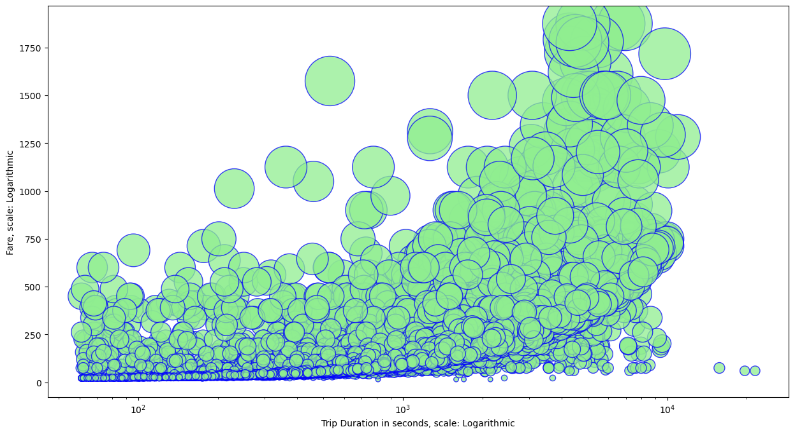
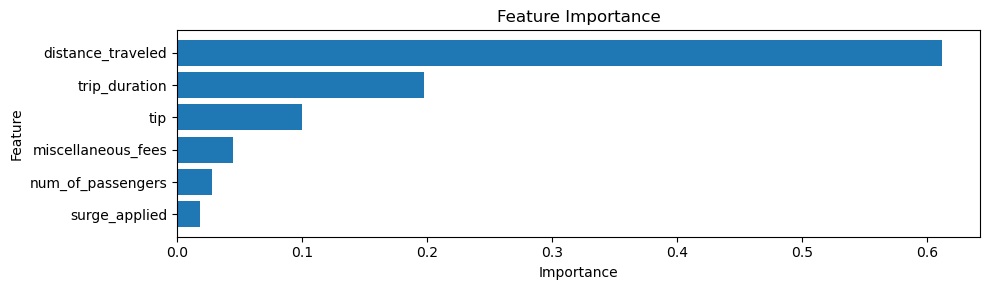
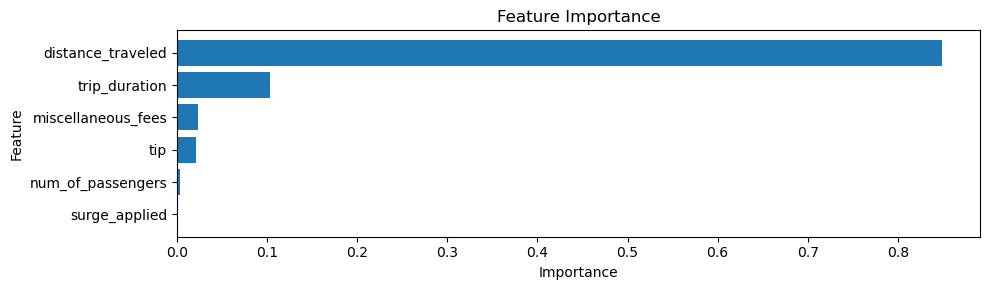

Here is a possible readme script for GitHub in markdown code:

# NYC Taxi Fare Prediction
This project aims to predict the total fare for a taxi ride based on various features such as trip duration, distance traveled, number of passengers, etc. The data is obtained from the [Data Science Student Championship 2023 Hackathon on MachineHack](https://machinehack.com/hackathons/data_science_student_championship_2023/) and contains information about thousands of taxi trips.

## Data Description
The data consists of the following features:

- `trip_duration`: How long did the journey last? (in seconds)
- `distance_traveled`: How far did the taxi travel? (in Km)
- `num_of_passengers`: How many passengers were in the taxi?
- `fare`: What's the base fare for the journey?
- `tip`: How much did the driver receive in tips?
- `miscellaneous_fees`: Were there any additional charges during the trip?
- `total_fare`: The grand total for the ride (this is your prediction target!
- `surge_applied`: Was there a surge pricing applied? Yes or no?

## Data Preprocessing
The following steps were taken to clean and prepare the data for modeling:

- Removed outliers and invalid values such as negative or zero fares, distances, or durations.
- Imputed missing values with KNN Imputer depending on the feature.
- Created new features such as `speed` from existing features.
- Encoded categorical features such as `surge_applied` with one-hot encoding.
- Scaled numerical features with standardization.

## Exploratory Data Analysis
Some data visualizations were used to understand the data and its distribution. For example, here are some plots showing the relationship between different features and the target variable:

## Feature Selection
Feature importance was visualized for different models to identify the most relevant features for predicting the total fare. For example, here are some plots showing the feature importance for XGBoostRF, Random Forest, and Linear Regression models:

## Model Building
Several machine learning models were trained and evaluated on the data using cross-validation and hold-out validation. The models used were:

- XGBoostRF
- Random Forest
- Linear Regression
- Decision Tree
- Artificial Neural Network

The metrics used to measure the performance of the models were R2 score and Root Mean Squared Log Error (RMSLE). The results are summarized in the table below:

| Model | R2 Score (Train) | R2 Score (Test) | RMSLE (Test) |
|-------|------------------|-----------------|--------------|
| XGBoostRF | 0.909 | 0.925 | 0.086 |
| Random Forest | 0.907 | 0.922 | 0.086 |
| Linear Regression | 0.868 | 0.887 | 0.130 |
| Decision Tree | 0.892 | 0.909 | 0.095 |
| Artificial Neural Network | - | 0.923 | 0.097 |

The best performing model was XGBoost, followed by Random Forest.

## Model Tuning
Hyperparameter tuning was performed on every models using GridSearchCV to find the optimal parameters that would improve the model performance. The tuned models achieved slightly better results than the default models.

## Model Ensembling
An ensemble averaging model was created by combining the predictions of XGBoost and Random Forest models with equal weights. The ensemble model achieved a slightly better result than any individual model, as shown in the table below:

| Model | R2 Score (Train) | R2 Score (Test) | RMSLE (Test) |
|-------|------------------|-----------------|--------------|
| Ensemble Model | - | 0.930 | 0.084 |

## Conclusion
The project demonstrated the use of different machine learning algorithms and data preprocessing techniques to predict the total fare for a taxi ride. The best performing model was ensemble model, followed by XGBOOSTRF and ANN. The final score achieved on the test data was 0.16256. The project also showed the importance of feature engineering, feature selection, and hyperparameter tuning to improve the model performance.

## Future Work
Some possible improvements and extensions for this project are:

- Use more advanced feature engineering techniques such as polynomial features, interaction terms, or feature extraction.
- Use more advanced models such as LightGBM, CatBoost, or Stacking.
- Use more advanced hyperparameter tuning techniques such as Bayesian Optimization, Random Search, or Genetic Algorithms.
- Use more advanced ensemble techniques such as weighted averaging, voting, or blending.
- Use more advanced evaluation metrics such as Mean Absolute Error, Mean Squared Error, or Mean Absolute Percentage Error.
